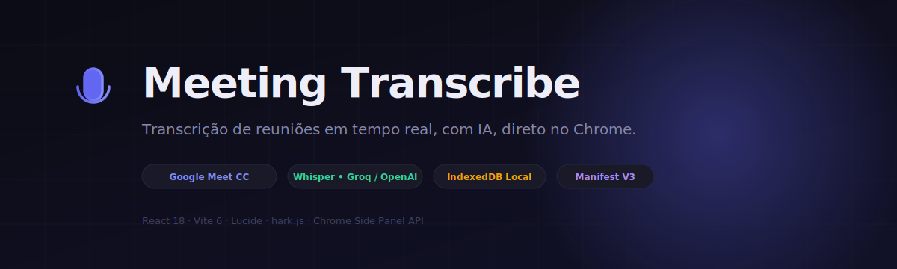
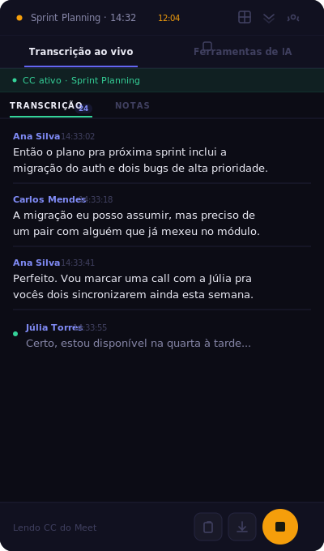
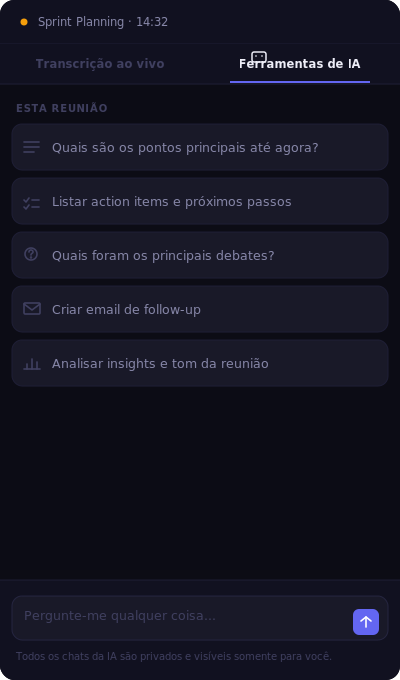
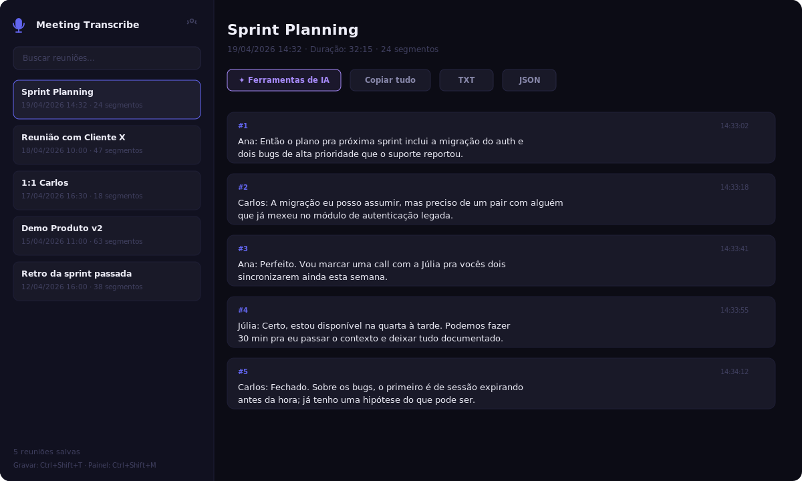
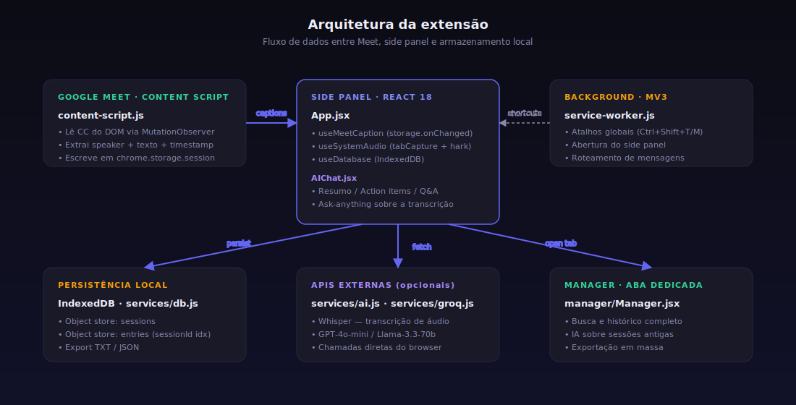

<p align="center">
  
</p>

<p align="center">
  <a href="#"></a>
  <a href="#"></a>
  <a href="#"></a>
  <a href="LICENSE"></a>
  <a href="#"></a>
</p>

<h1 align="center">Meeting Transcribe</h1>

<p align="center">
  Chrome extension that transcribes <b>Google Meet</b> meetings in real time, with a side panel, AI tools, and a full session manager in a dedicated browser tab.
  <br/>
  All transcripts and data are <b>stored locally in your browser</b> — no intermediate server is used.
</p>

---

## Preview

<p align="center">
  
  &nbsp;&nbsp;
  
</p>

<p align="center">
  <i>Side panel with live transcription and speaker identification (left) and integrated AI tools (right)</i>
</p>

<p align="center">
  
</p>

<p align="center">
  <i>Full session manager in a dedicated browser tab</i>
</p>

---

## Overview

Meeting Transcribe has two transcription modes that work in parallel:

| Mode | How it works | API required? |
| --- | --- | :---: |
| **Google Meet CC** | A content script reads the native Meet captions directly from the DOM, with speaker label and timestamp | ❌ No |
| **Audio capture** | Captures the tab audio via `chrome.tabCapture` and sends it to Whisper (Groq/OpenAI) | ✅ Yes |

All sessions are persisted to **IndexedDB** inside the browser itself. History can be exported as TXT or JSON.

---

## Key features

- **Native Chrome side panel** (Side Panel API)
- **Real-time transcription** with speaker identification
- **Session manager** in a dedicated tab (`manager.html`)
- **AI tools** over the full transcript:
  - Meeting summary
  - Action items and next steps
  - Ready-to-send follow-up email
  - Questions and answers (Q&A)
  - Insights and meeting tone analysis
  - Free-form question via chat (ask anything)
- **Export** to TXT and JSON
- **Free-form notes** per session
- **Global shortcuts** (`Ctrl+Shift+T` / `Ctrl+Shift+M`)
- **Auto-detection** when the user joins a Meet call
- Supports **OpenAI** (gpt-4o-mini + whisper-1) and **Groq** (llama-3.3-70b + whisper-large-v3)
- **100% local** — the API key lives in `localStorage`, nothing is sent to third-party servers

---

## Stack and architecture

<p align="center">
  
</p>

| Layer | Technology |
| --- | --- |
| Framework | React 18 |
| Bundler | Vite 6 (multi-entry: `sidepanel.html`, `popup.html`, `manager.html`) |
| Manifest | Chrome Extensions MV3 |
| Icons | Lucide React (SVG) + PNGs generated via Jimp |
| Voice detection | `hark.js` over `MediaStreamAudioSourceNode` |
| Local database | IndexedDB (custom implementation in `src/services/db.js`) |
| CS ↔ Panel messaging | `chrome.storage.session` + `chrome.storage.onChanged` |
| Transcription (audio) | Whisper via Groq / OpenAI API |
| AI generation | OpenAI `gpt-4o-mini` or Groq `llama-3.3-70b-versatile` |

### Folder structure

```
meeting-transcribe/
├── public/
│   ├── manifest.json          # Manifest V3
│   ├── service-worker.js      # background worker
│   ├── content-script.js      # Meet CC reader
│   └── icons/                 # icon16.png, icon48.png, icon128.png
├── scripts/
│   └── gen-icons.js           # PNG generation via Jimp
├── src/
│   ├── App.jsx                # main side panel
│   ├── components/
│   │   ├── AIChat.jsx         # side panel AI chat
│   │   ├── AIPanel.jsx        # manager AI panel
│   │   ├── Modal.jsx          # custom confirmation modal
│   │   ├── Settings.jsx       # provider/token configuration
│   │   └── Sessions.jsx       # list of saved sessions
│   ├── hooks/
│   │   ├── useDatabase.js     # IndexedDB wrapper
│   │   ├── useSystemAudio.js  # tab audio capture
│   │   └── useMeetCaption.js  # Meet captions listener
│   ├── manager/
│   │   ├── Manager.jsx        # full management tab
│   │   └── manager.css
│   ├── popup/
│   │   └── Popup.jsx          # extension icon popup
│   ├── services/
│   │   ├── ai.js              # chat completion calls
│   │   ├── db.js              # IndexedDB (sessions + entries)
│   │   └── groq.js            # transcription via Whisper
│   └── styles/
│       └── app.css            # side panel design system
├── popup.html
├── sidepanel.html
├── manager.html
├── docs/
│   └── images/                # README assets
└── vite.config.js             # multi-entry
```

---

## Installation (local use)

### 1. Clone and install dependencies

```bash
git clone https://github.com/jardelva96/meeting-transcribe.git
cd meeting-transcribe
npm install
```

### 2. Build

```bash
npm run build
```

The `dist/` folder will contain the ready-to-load extension.

### 3. Load into Chrome

1. Open `chrome://extensions`
2. Enable **Developer mode** (top-right corner)
3. Click **Load unpacked**
4. Select the `dist/` folder
5. Done. The microphone icon will appear in the Chrome toolbar.

### 4. (Optional) Configure AI

Click the gear icon in the side panel → choose **OpenAI** or **Groq** → paste your API key.

- OpenAI: https://platform.openai.com/api-keys
- Groq: https://console.groq.com/keys

The key is saved only in `localStorage` and never leaves your browser.

---

## How to use

### In a Google Meet call

1. Join the call.
2. Click the **CC** (captions) button at the bottom of Meet.
3. Open the side panel through the extension or with `Ctrl+Shift+M`.
4. The transcript shows up automatically — **no API key required**.
5. Stop the session with the stop button when you want to archive it.

### In any other meeting (Zoom, Teams, YouTube, etc.)

1. Open the side panel.
2. Click the amber record button (or `Ctrl+Shift+T`).
3. The audio from the current tab is captured and streamed in chunks to Whisper.
4. The transcript appears in real time.

### AI tools

On the **AI tools** tab you can run quick actions or ask free-form questions about the current meeting. Everything runs on top of the transcript, without re-uploading the audio.

### Manager

Click the grid icon in the topbar to open the **Manager** in a new tab: meeting search, full history, export, delete with confirmation, and AI execution on older sessions.

---

## Shortcuts

| Shortcut | Action |
| --- | --- |
| `Ctrl+Shift+T` | Start / stop audio recording |
| `Ctrl+Shift+M` | Open the side panel |

*(On macOS, use `Cmd` instead of `Ctrl`.)*

---

## Requested permissions

| Permission | Reason |
| --- | --- |
| `tabCapture` | capture the tab audio for transcription |
| `storage` | persist settings and sessions |
| `activeTab` | identify the current tab for capture |
| `sidePanel` | show the side panel |
| `tabs` | open the manager in a new tab |
| `host_permissions: https://meet.google.com/*` | inject the content script that reads the CC |

None of these permissions involve reading the content of pages other than Google Meet.

---

## Privacy

- **Audio never passes through a project server.** When you use the Whisper mode, the audio goes directly from your browser to the API provider you configured (OpenAI or Groq).
- **Transcripts stay in local IndexedDB.** Nothing is synced to the cloud.
- **API keys live in the browser's `localStorage`.**
- **The Meet content script** only reads captions already generated by Google — it does not record anything and does not intercept raw audio.

---

## Development

```bash
npm run dev                 # Vite dev server (useful for testing UI outside the extension)
npm run build               # builds dist/ ready to load as an unpacked extension
node scripts/gen-icons.js   # regenerates the extension PNGs
```

To reload changes in the extension, use the reload button on `chrome://extensions`.

---

## Roadmap

- [ ] Automatic cleanup of old sessions (> 90 days, opt-in)
- [ ] Microsoft Teams CC support
- [ ] Audio upload for offline transcription of already-recorded meetings
- [ ] Configurable light / dark mode
- [ ] Google Drive integration for automatic backup
- [ ] Transcript import from TXT / VTT / SRT

---

## License and copyright

Copyright © 2026 **Jardel Vieira Alves**. All rights reserved.

Distributed under the [MIT License](LICENSE) — you may use, copy, modify, embed in other products and distribute, as long as you keep the copyright notice and the original license.

This software is provided "as is", without warranty of any kind. See the [LICENSE](LICENSE) file for full terms.

### Trademarks

- *Google Meet* is a registered trademark of Google LLC. This project is not affiliated with, endorsed by, or maintained by Google.
- *OpenAI*, *Whisper* and *GPT* are registered trademarks of OpenAI, L.L.C.
- *Groq* and *Llama* are registered trademarks of their respective owners.

---

## Author

**Jardel Vieira Alves**
[github.com/jardelva96](https://github.com/jardelva96)

Contributions, issues and suggestions are welcome.
